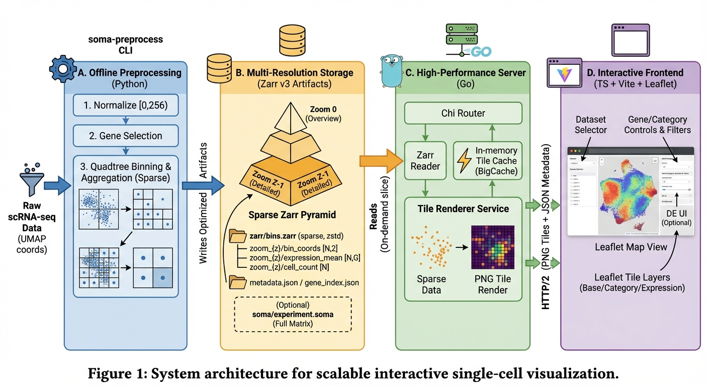

# AtlasMap

**AtlasMap: enabling low-cost, map-style exploration of million-cell single-cell atlases**

High-performance single-cell visualization system for 10M+ cells.

Detailed usage/deployment guide: `doc/how-to-use.md`.

## Architecture

AtlasMap is a two-stage pipeline: **offline preprocessing** turns an `.h5ad` into a tile-friendly,
multi-zoom bin store, and an **online Go server** renders Leaflet-compatible PNG tiles on demand.
A static TypeScript frontend consumes the JSON + tile endpoints.



```text
┌──────────────────────────────────────────────┐
│               Offline (Python)               │
│  preprocessing/ (atlasmap-preprocess CLI)    │
│  - normalize UMAP coords to [0,256)          │
│  - select preaggregated genes                │
│  - quadtree binning for zoom=0..Z-1          │
│  - per-bin aggregation (sparse non-empty)    │
└───────────────────────────┬──────────────────┘
                            │ writes
                            ▼
┌────────────────────────────────────────────────────────────────────────┐
│ Data artifacts (per dataset)                                            │
│                                                                        │
│  zarr/metadata.json + zarr/gene_index.json                              │
│  zarr/bins.zarr  (Zarr v3, zstd chunks)                                 │
│    zoom_{z}/bin_coords        int32  [N,2]   (bin_x,bin_y)              │
│    zoom_{z}/cell_count        uint32 [N]                                  │
│    zoom_{z}/expression_mean   float32 [N,G] (preaggregated genes)       │
│    zoom_{z}/expression_max    float32 [N,G]                              │
│    zoom_{z}/category_counts/* uint32 [N,C] (per column)                 │
│    zoom_{z}/cell_ids/*        ragged cell indices (optional; off by default) │
│                                                                        │
│  soma/experiment.soma (optional; TileDB-SOMA full matrix + obs/var)     │
└───────────────────────────┬────────────────────────────────────────────┘
                            │ read
                            ▼
┌────────────────────────────────────────────────────────────────────────┐
│ Online (Go)                                                           │
│  server/ (chi router)                                                 │
│  - multi-dataset registry (/api/datasets, /d/{dataset}/...)            │
│  - Zarr reader (loads sparse bins + per-gene/category vectors)         │
│  - tile service: render from highest zoom and slice per {z,x,y}        │
│  - PNG renderer (256x256; base/category/expression)                    │
│  - in-memory tile cache (BigCache; dataset-aware keys)                 │
│  - (optional, -tags soma) SOMA endpoints + DE job runner (SQLite)      │
└───────────────────────────┬────────────────────────────────────────────┘
                            │ HTTP (PNG tiles + JSON)
                            ▼
┌────────────────────────────────────────────────────────────────────────┐
│ Web Frontend (TS + Vite + Leaflet)                                     │
│  frontend/                                                            │
│  - dataset selector + metadata bootstrap                               │
│  - Leaflet tile layers: base/category/expression                        │
│  - gene/category controls + filters + (optional) DE UI                 │
└────────────────────────────────────────────────────────────────────────┘
```

### Runtime flow (happy path)

1. Frontend calls `GET /api/datasets` to get the dataset list and default.
2. Frontend bootstraps the selected dataset via `GET /d/{dataset}/api/metadata` (bounds/zoom/genes/categories).
3. Leaflet requests PNG tiles at native zooms `z=0..zoom_levels-1`:
   - base: `GET /d/{dataset}/tiles/{z}/{x}/{y}.png`
   - category: `GET|POST /d/{dataset}/tiles/{z}/{x}/{y}/category/{column}.png` (optional filter)
   - expression: `GET /d/{dataset}/tiles/{z}/{x}/{y}/expression/{gene}.png?colormap=...`
4. Server renders from the highest available bin zoom (sparse bins) and caches the resulting PNG bytes.
5. If the server is built with `-tags soma` and the dataset has `soma_path`, extra endpoints become available
   for arbitrary gene queries and differential-expression jobs (persisted in SQLite).

## Quick Start

### Prerequisites

- Go 1.22+
- Node.js 20+
- Python 3.9+
- Docker (optional)

### Installation

```bash
# Clone the repository
git clone https://github.com/your-org/atlasmap-sc.git
cd atlasmap-sc

# Install all dependencies
make install
```

### Preprocessing

```bash
# Run preprocessing on your H5AD file
make preprocess INPUT=path/to/data.h5ad

# Or use the CLI directly
cd preprocessing
pip install -e .
atlasmap-preprocess run -i data.h5ad -o ../data/preprocessed -g 500 -z 8
```

### Development

```bash
# Start development servers (Go backend + Vite frontend)
make dev

# Or start separately:
# Terminal 1: Go server
cd server && go run ./cmd/server -config ../config/server.yaml

# Terminal 2: Frontend
cd frontend && npm run dev
```

### Docker

```bash
# Build and start all services
docker-compose up -d

# Run preprocessing in Docker
docker-compose run --rm preprocess run \
    --input /data/raw/input.h5ad \
    --output /data/preprocessed
```

## Project Structure

```
atlasmap-sc/
├── preprocessing/          # Python preprocessing pipeline
│   ├── atlasmap_preprocess/
│   │   ├── pipeline.py     # Main pipeline
│   │   ├── binning/        # Quadtree binning
│   │   └── io/             # Zarr & SOMA I/O
│   └── pyproject.toml
│
├── server/                 # Go backend
│   ├── cmd/server/         # Entry point
│   └── internal/
│       ├── api/            # REST API
│       ├── render/         # Tile rendering
│       └── data/zarr/      # Zarr reader
│
├── frontend/               # Vanilla JS/TS frontend
│   ├── src/
│   │   ├── map/            # Leaflet integration
│   │   ├── components/     # UI components
│   │   └── api/            # API client
│   └── index.html
│
├── config/                 # Configuration files
├── data/                   # Data directory (gitignored)
│   └── preprocessed/
│       ├── zarr/           # Bin aggregations
│       └── soma/           # Full expression (TileDBSOMA)
└── docker-compose.yml
```

## API Endpoints

All API and Tiles endpoints require a dataset prefix `/d/{dataset}`. Use `GET /api/datasets` to list available datasets.

### Tiles
- `GET /d/{dataset}/tiles/{z}/{x}/{y}.png` - Base tile
- `GET /d/{dataset}/tiles/{z}/{x}/{y}/expression/{gene}.png` - Expression colored tile

### Metadata
- `GET /api/datasets` - List available datasets (global)
- `GET /d/{dataset}/api/metadata` - Dataset metadata
- `GET /d/{dataset}/api/genes` - List of pre-aggregated genes
- `GET /d/{dataset}/api/categories` - Category information

## Configuration

See `config/server.yaml` for server configuration options.

### Single Dataset (Legacy Format)

```yaml
server:
  port: 8080
  cors_origins:
    - "http://localhost:3000"

data:
  zarr_path: "/data/preprocessed/zarr/bins.zarr"
  soma_path: "/data/preprocessed/soma"

cache:
  tile_size_mb: 512
  tile_ttl_minutes: 10

render:
  tile_size: 256
  default_colormap: viridis
```

### Multiple Datasets

You can configure multiple datasets. The first dataset becomes the default:

```yaml
server:
  port: 8080
  cors_origins:
    - "http://localhost:3000"

data:
  pbmc:
    zarr_path: "/data/pbmc/zarr/bins.zarr"
    soma_path: "/data/pbmc/soma"
  liver:
    zarr_path: "/data/liver/zarr/bins.zarr"
    soma_path: "/data/liver/soma"

cache:
  tile_size_mb: 512
  tile_ttl_minutes: 10

render:
  tile_size: 256
  default_colormap: viridis
```

When multiple datasets are configured:
- The frontend displays a dataset selector dropdown
- Each dataset is accessible via `/d/{dataset}/api/...` and `/d/{dataset}/tiles/...`

## License

MIT
